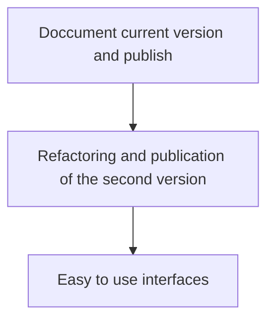

# Rotifer Hackaton 2026

## Summary

This repository's aim is to build basic teaching material for protein sequence, structure and genomic context analysis using the ROTIFER library.

## Resources

### Git

Basics command 
https://gamma.app/docs/Git-GitHub-rzcm2bzmbz151mz?mode=doc

## Bullet points

- Hackaton will become a published tutorial 
- During it, procedures will be adjusted
  - HMM construction
  - Storage of HMMs on rotifer_data
  - Genomic context
  - Structural algorithms
  - Data presentation: Viz!
  - Coordinate with rotifer development
    - **BRANCHES**
    - Coordinate where code will be stored -> **avoid duplications**// **avoid hardcoding** ¹
- Current target: ==T4SS==
  - Help wanted!

¹ Ensure good design decisions, so we don't create bugs and our modularity is wel maintained

## Roadmap

## Interesting links

1. https://github.com/Sam-Sims/salti (Terminal visualizer)